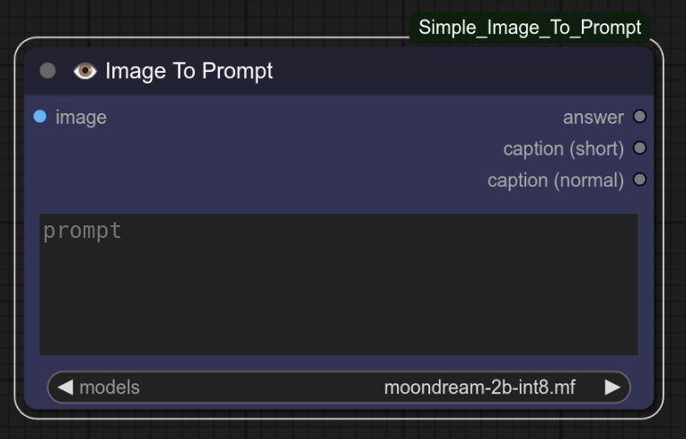
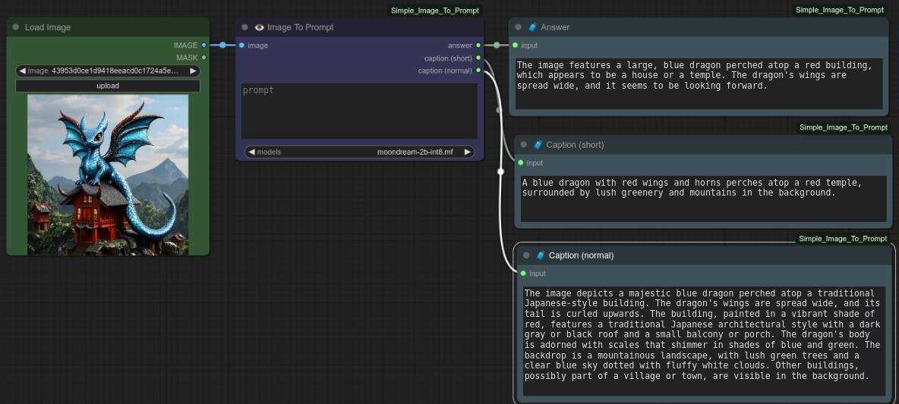

# ComfyUI-RealESRGAN_Upscaler  

> [!IMPORTANT]  
> 
🚧 This documentation is still under 
> construction. The development of the upscaler is a ongoing 
> activity. There might be small differenes in comparison of 
> node and documentation.

> [!CAUTION]
> 
Please note, that the node will run, only
> if an error in one Python package file is fixed. See the 
> related section for informations on this topic.
 

## Preface

This node uses the RealESRGAN model from
xinntao [1]. This is my personal favourite upscaling model and 
upscaling approach.

## Prerequisites

What I am writing is valid for a computer on
which as the operating system Linux is installed.

To run the upscaler one needs a NVIDIA graphic
card.

## Whats New

Yesterday I added a bunch of things to the node.
Now the node is a little bit more complicated than before. On the 
other hand side the node considers now everything which is possible
to do with the node.

## Upscaling

One can set the scaling factor in steps of 0.1
in the node. For the moment there is no known limit for the scaling
factor. I used for example an unrealistic scaling factor of 30.0 
for upscaling of a test image. The limiting factor is in this case 
the size of the image file.

## Node Preview

Figure 1 shows the node preview. Input is an image. 
Main output is the upscaled image. In addition to this one can output
the local installation with respect to the GPUs. In case of an error
the error can be printed too.

<i>Figure 1: Main node preview</i>

## Node Parameter
The node has following parameter

+ scale_factor (FLOAT)
+ tile_number (INT)
+ tile_pad (INT)
+ pre_pad (INT)
+ fp_format (STRING)
+ denoise (FLOAT)
+ netscale (INT)
+ gpu_id (LIST)
+ model (LIST)

For an upscaling one needs in a first shot the scale 
factor and a model. The other parameter can be as they are. For a 
resolution of the image of 512 x 512 pixel this is in general valid.
 

Over the gpu_id the user can decide, which GPU should be used for the upscaling.

Depending on the hardware one needs the tiling. In my case I needs tiling 
for a resolution of 1024 upwards.

## Model Selection

<i>Figure 2: Model selection</i>

## What the Node Does

The node can upscale images which have following formats

- JPG/JPEG
- PNG
- WEBP

## Workflow Preview

Figure 3 shows the example workflow preview.

<i>Figure 3: Workflow preview</i>

Figure 4 shows the example workflow preview.

<i>Figure 4: Workflow preview</i>

## Installation

Use the ComfyUI Manager for the installation.
Use my nick 'zentrocdot' or for 'ComfyUI_realESRGAN_Upscaler'

## Known Problems

While first run I got an error message that the installation
of the node failed. After first investigation I found the 
problem. Fix for the moment is as follows. Go into directory
ComfyUI. Then search for a file.

<code>find -name "degradations.py"</code>

This looks like.

<code>./venv/lib/python3.10/site-packages/basicsr/data/degradations.py</code>

Open the file e.g.

<code>nano ./venv/lib/python3.10/site-packages/basicsr/data/degradations.py</code>

and change

<code>from torchvision.transforms.functional_tensor import rgb_to_grayscale</code>

to

<code>from torchvision.transforms.functional import rgb_to_grayscale</code>

After that, the node will work.

## Bug Fixing

in the directory is a file called fix.bash. This can be used to fix
the bug in the Python package.

## Error Screen

While working on the node I have also provoked errors for testing purposes. 
When the number of netscale is not matching the value of the model's
netscale one got an error. 

<i>Figure 5: Error message preview</i>

The error led to unexpected behaviour of the node.
This was the reason to rethink the programming. Now I catch the error
Over the output ERROR one can make such an error visible. To prevent 
misleading results the output is an empty image with text.
 

## Limitations

Limitation at the moment not known.

## To-Do

There are a plenty of things to to

## Example Using Converted Models

Figure 6 and Figure 7 show two examples where
I used two converted models for the upscaling. it depends on your
personal taste which upscaler you like.
 

<i>Figure 6: Upscaling using 4x-UltraSharp.pth</i>

<i>Figure 7: Upscaling using 4xNomos8kSC.pth</i>

## Credits

Special credits goes to xinntao (Xintao Wang) for his excellent 
work on ESRGAN and RealESRGAN models The results achieved are quite impressive.
 

## Final Words

Have fun. Be inspired!

# Reference

[1] https://github.com/xinntao/Real-ESRGAN

[2] https://github.com/xinntao/Real-ESRGAN/blob/master/docs/model_zoo.md

[3] https://arxiv.org/abs/2107.10833

[4] https://github.com/zentrocdot/ESRGAN_RRBD_CONVERTER

[5] https://github.com/ltdrdata/ComfyUI-Manager

[6] https://openmodeldb.info/
